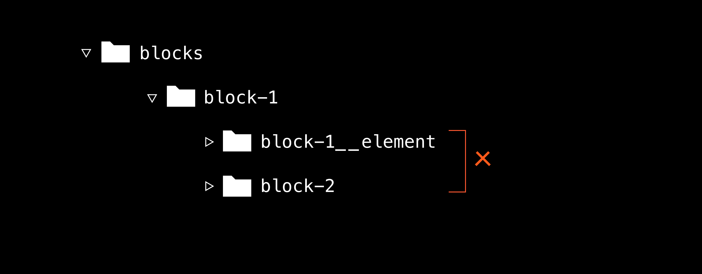

# Проект. Путешествие по России

Что за проект: адаптивная страница про путешествия по стране
Где описание и иллюстрации: на этой странице и в макете в «Фигме»
Откуда взять основу: из архива
Где работать: в локальном репозитории, а потом закоммитить и залить файлы к себе в удалённый репозиторий. Когда закончите, выложите на GitHub Pages, чтобы показать другим
Как проверить: по чек-листу

## Описание

Подготовка десктоп-версии проекта — лишь часть дела. Нужно приложить немалые усилия, чтобы веб-страница выглядела отлично на всех устройствах. 

Делайте проектную работу в локальном репозитории, коммитьте и заливайте файлы к себе в удалённый репозиторий.

Итогом этого task станет проект о путешествиях по стране. Он должен корректно отображаться на экранах популярных размеров.

В макете в «Фигме» показан дизайн страницы для ширины в 320, 768, 1024 и 1280 пикселей. Тексты написаны бесплатным шрифтом ”Inter“ от дизайнеров «Фигмы». Его можно скачать на официальном сайте во вкладке ”Download“. Используемые шрифты подключайте локально. Тексты берите прямо из макета. 

Видео, в котором показываем, как это делать: video01.mp4

Дизайн-макет — это демонстрация, как должен выглядеть сайт на различных разрешениях. Эти разрешения вовсе не должны совпадать с точками перелома в медиа-запросах. Рекомендуем сосредоточиться на пяти интервалах:
- от 1280 пикселей — от стандартных ноутбуков и до бесконечности,
- от 1024 и до 1280 — для небольших ноутбуков,
- от 768 и до 1024 пикселей — от вертикального до горизонтального положения планшета,
- от 425 и до 768 пикселей — от большого смартфона до вертикального положения планшета,
- до 425 пикселей — мобильные устройства.

Этих переломных точек хватает, чтобы сайт вёл себя однородно — без явных отклонений от заданного в макете поведения. Но если их всё же не хватит, добавьте свои и уточните поведение элементов для интервалов поменьше. А если блоки ведут себя как на макете — не пишите медиа-запрос. С опытом придёт умение стройно использовать правила CSS и задействовать меньшее количество интервалов без потери в качестве отображения.

Старайтесь реализовать плавное сжатие сайта. Проверьте, что элементы не «ломаются» и выглядят как в макете между точками перелома. Скажем, на ширине 470, 665, 999 или 1100 пикселей. Обращайте внимание на следующие моменты:
- отступы между элементами и размеры шрифтов нередко изменяются;
- ради «резинового» эффекта нужно уметь отказаться от пиксельных значений ширин и высот в пользу относительных %, vw, vh, fr;
- если картинки занимают 100% ширины в макете, не бойтесь использовать для них CSS-свойство width: 100%. Для элементов img **высота будет подсчитана автоматически;
- используйте CSS-функцию calc() **— она годится не только для повторения арифметики, но и для расчёта размера колонок и ширины блоков;
- не усложняйте себе задачу, используйте пиксели для описания размеров шрифтов. Знание em и rem вам пригодится на собеседованиях или в компаниях с очень строгим код-стайлом;
- используйте десятичные дроби, когда задаёте интерлиньяж. Это хорошая практика;
- если замечаете, что изображения масштабируются непропорционально в точках перелома, вспомните свойство object-fit. Оно здорово помогает в таких ситуациях;
- не забудьте сгладить шрифты;
- используемые шрифты подключайте локально.

Копируйте из «Фигмы» только свойства размеров шрифтов и значений цвета. Продумывайте и выбирайте позиционирование, типы элементов, их высоту и ширину, опираясь на изученные концепции. А иногда и на поисковик. Коварная «Фигма» часто подталкивает к абсолютному позиционированию — не поддавайтесь на провокации.

Не забудьте про оптимизацию изображений https://tinypng.com/. Иногда это позволяет сэкономить до 80% веса, сохранив разрешение картинок и без видимых потерь в качестве. Если не хотите экспортировать изображения самостоятельно —  архив с оптимизированными картинками. Но помните, в реальной жизни дизайнер их не пришлёт.
Если будете экспортировать картинки сами — постарайтесь называть их единообразно. Посмотрите, как они названы в архиве. Красота кроется в деталях.

В вёрстке проекта постройте файловую структуру по БЭМ и комбинируйте концепции, пройденные в предыдущих спринтах. Адаптивная вёрстка по макету — это в первую очередь принятие решений и только во вторую — их реализация в коде.

### Выложите проектную работу на GitHub Pages

Выложите работу на GitHub Pages, чтобы её можно было показать другим. https://www.notion.so/7cb334fd531d46368620df88678e66b1?pvs=21

В ветке main создайте файл README.md и оформите его. В файле должна быть ссылка проекта на GitHub. Если проект сделан по БЭМ, то в корне проекта нужен файл .nojekyll.

## Чек-лист проекта «Путешествие по России»

Здесь вы найдёте критерии, которым должна соответствовать работа, а также общие рекомендации — их нужно учесть, чтобы выявить и самостоятельно исправить частые ошибки.

Общие требования к проекту
- Отображение в Firefox, Google Chrome или Yandex Browser однотипно.
- Репозиторий содержит все необходимые файлы: изображения, файлы стилей, шрифты и HTML:
  - Файл index.html находится в корне проекта.
  - Файл normalize.css находится в папке vendor в корне проекта.
  - Папка blocks содержит файловую структуру БЭМ Nested.
  - Файл index.css находится в папке pages в корне проекта.
  - Папка images содержит изображения.
  - Файл README.md находится в корне проекта.
  - Шрифты(Inter-Black, Inter-Bold, Inter-Regular) находятся в папке fonts, подключения @font-face описаны в fonts.css
-- В проекте отсутствуют пустые файлы.
- Стили подключены отдельным файлом:
  - В <head> index.html подключён один файл index.css c импортами стилей страницы.
normalize.css подключён самым первым в порядке импортов в index.css.
  - Файл normalize.css необходимо оставить в изначальном виде.
- Корректно задан viewport, прописаны title и lang.
- Стили подключены в отдельном файле.
- Присутствуют все секции из макета.
- Вёрстка не ломается между брейкпоинтами:
  - Текст не выходит за границу своего блока.
  - Нет горизонтальных скроллов на промежутке от 320 пикселей до бесконечности.
  - В блоках с контентом — comments, places и подобных — текст не переносится через каждые два слова и не выходит за границы своего блока.

- Ширина элементов и отступы отличаются от макета не больше, чем на 30 px на контрольных точках:
  - 1280 px,
  - 1024 px.
- И на 10 px на контрольных точках:
  - 768 px,
  - 320 px.
- Рекомендуем использовать PixelPerfect, чтобы контролировать, как отображается вёрстка.
- Код форматирован одинаково, соблюдается иерархия отступов в соответствии с хорошими практиками.
- Файл README.md содержит:
  - заголовок-название,
  - описание проекта и его функциональности,
  - указание, что за технологии используются.
  - ссылку на GitHub Pages.
- Без использования LiveServer: изображения проекта отображаются, стили подключены.
  - В проекте используются относительные пути до файлов.
- Нет ошибок в этом валидаторе https://validator.w3.org/nu/.

### БЭМ-методология

- Не используются числа в названиях классов.
- Структура построена по БЭМ.
Примеры правильной и неправильных файловых структур:

.png>)

.png>)

### Семантика

- Для вёрстки заголовков применяются несколько тегов от <h1> до <h6>. Текстовые блоки размечены тегами 
, списки — <ul>и <li>. Присутствуют и используются по назначению элементы <header>, <main>, <footer>, <section>, <nav>.
- Не используются элементы <b>,  , <i>.
- Элементы не обёрнуты в 
, если это не нужно для выравнивания.
- Переключатели языков сделаны ссылками. Для подчёркивания используется модификатор, отображающий состояние.
  - Название модификатора должно отображать состояние, а не название языка. Например, допустимо название модификатора _active
- Контентно-значимые картинки, иллюстрирующие текст, вставлены через  и в них присутствует alt с описанием, соответствующим языку страницы. Изображения не искажаются и выглядят в соответствии с макетом на всех разрешениях, предусмотренных макетом.

### Заголовки

-  странице нет скрытых элементов.
- На странице есть заголовок первого уровня. Заголовки соответствуют иерархии страницы.

### БЭМ

- Не используются селекторы по тегу.
- Нет вложенности более двух селекторов.
- Создана файловая структура по БЭМ (Nested):
  - В файле каждого блока, элемента и модификатора описаны только стили, которые к ним относятся.
  - Директории с блоками не вложены в другие блоки.
- Модификаторы содержат только те CSS-свойства, которые изменяются в элементах. Модифицируемый элемент или блок не содержит изменяющееся в модификаторе CSS-свойство.
- Не используется «повышение веса» селектора модификатора, такое как block-name.block-name_mod-name.
- Нет классов, которые содержат в названии только БЭМ-модификатор. Например, 
. Правильно — 
.
- Отсутствуют классы с числовыми значениями, такие как 
.
- Компоненты со стилевым и логически похожим оформлением выделены в одну БЭМ-сущность: блок или элемент.
- Используется булевый БЭМ-модификатор для подчёркивания одного из языков.

### Доступность интерфейса

- Все ссылки и интерактивные элементы имеют состояние наведения :hover.
- Контентные изображения имеют alt с корректным описанием, которое соответствует языку страницы.

### CSS

- Контент на странице отцентрован.
- Установлен серый фон для всей страницы, нет белых полей по бокам.
- Не используется !important.
- Используется шрифт Inter. Размеры, начертания и цвет шрифта как в макете.
- Для каждого шрифта указаны альтернативные варианты из системных шрифтов. Не подключены лишние шрифты, в папке fonts не лежат лишние шрифты.
- Для установки размера блоков выбраны относительные величины и подходящие CSS-свойства. Например, для текстовых элементов лучше использовать max-width, нежели width.
- Внутренние отступы для каждой секции задаются отдельно, а не используются отрицательные margin.
- Ни одному текстовому блоку не задана фиксированная высота. Блок растягивается, если в него вставляют в 2–3 раза больше текста.
- У элементов с абсолютным позиционированием заданы координаты только по двум осям.
- Абсолютное позиционирование используется только там, где нельзя реализовать статичное или относительное позиционирование. Абсолютное позиционирование допустимо использовать для фоновых подложек под текстом, например, в блоке cover.
- Изображение затемняется при наведении на любую область блока cover, в том числе и на текстовые элементы. Наведение реализовано через :hover.
- Отсутствует горизонтальная прокрутка при изменении ширины окна просмотра в отладчике.
- Брейкпоинты сгруппированы. Если два брейкпоинта имеют небольшую пиксельную разницу в медиазапросе — например max-width: 1044px; и max-width: 1080px; — имеет смысл изменить разрешение и привести их к одинаковому значению.
- Проект визуально соответствует макетам. Вёрстка корректно отображается на разрешениях, предусмотренных макетами. Стандартные значения отступов у элементов — заголовков, параграфов, списков — обнулены в соответствии с брифом.
- Одинаковые свойства в разных медиазапросах не дублируются. В каждом медиазапросе должны быть описаны только те стили, которые отличаются от другого медиазапроса.

## Защита работы

Теперь «запушьте» выполненный код в свой репозиторий на гитхаб и отправьте ссылку на репозиторий на проверку.

